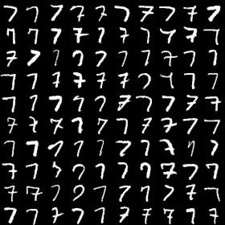
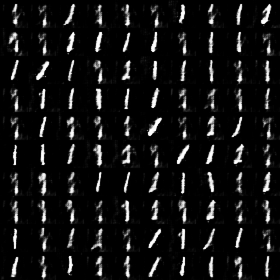
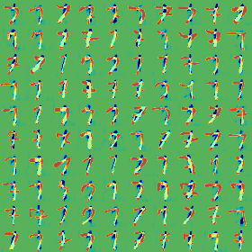

# AnoGAN keras implementation

Unsupervised anomaly detection with DCGAN

## Result

|  |  |  |

-----

## Requirements

- Python 3.6
- OpenCV 3.4.0 (option: build from src with highgui)
- h5py
- scikit-learn
- PyQt5
- tqdm
- [Keras 2.1.4](https://github.com/fchollet/keras)
- [TensorFlow 1.5.0](https://github.com/tensorflow/tensorflow)

## Usage  

First, check directory structure

    ├── main.py
    ├── anogan.py 
    ├── weights
        ├── discriminator.h5
        └── generator.h5
    └── result
        └── save the generated images when training

To test this project

    $ python main.py

To train a model

    $ python main.py --mode train

Then, the training steps(image) will be saved 'result' directory

-----------

    usage: main.py [-h] [--img_idx IMG_IDX] 
                        [--label_idx LABEL_IDX] 
                        [--mode MODE]

### Reference
paper : https://arxiv.org/abs/1703.05921
AnoGAN(code, keras) : https://github.com/yjucho1/anoGAN
AnoGAN(code, tf) : https://github.com/LeeDoYup/AnoGAN